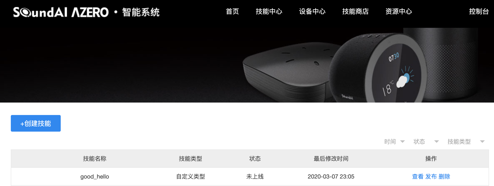
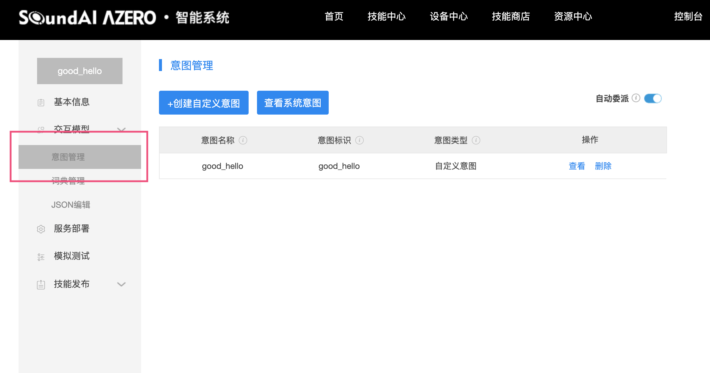
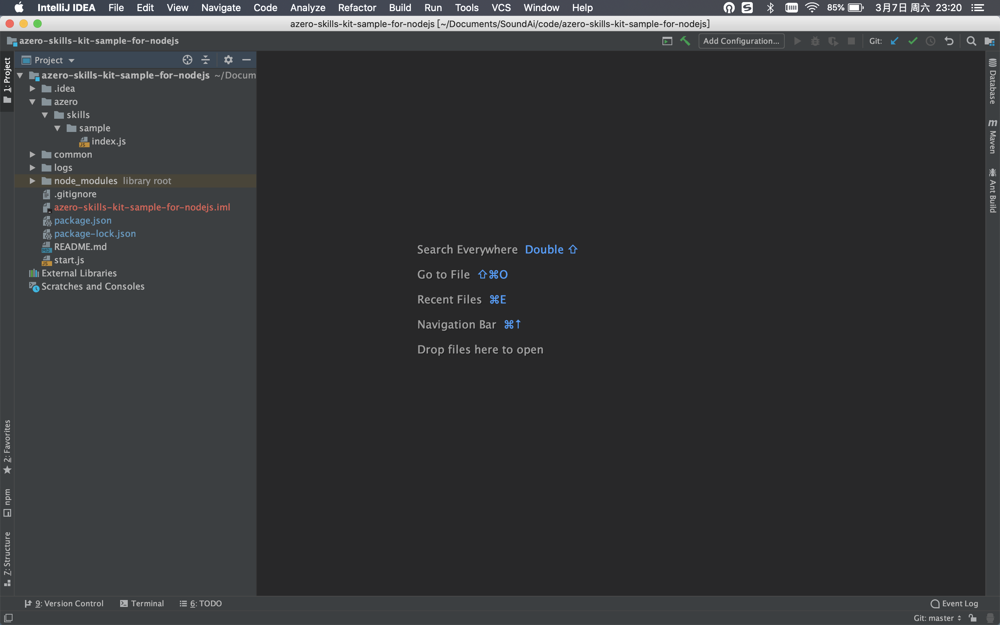
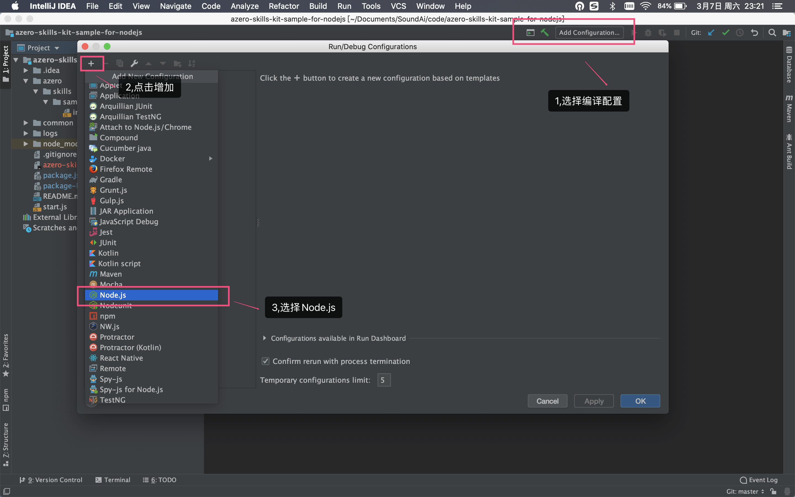
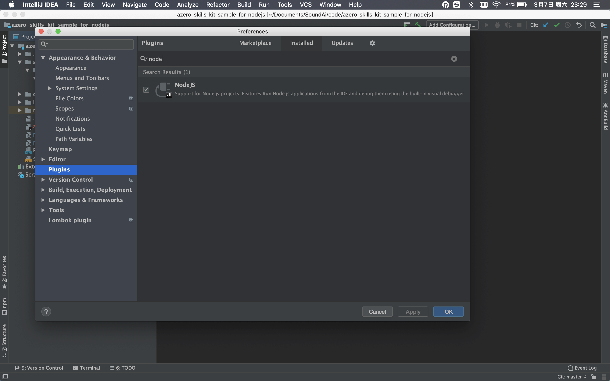
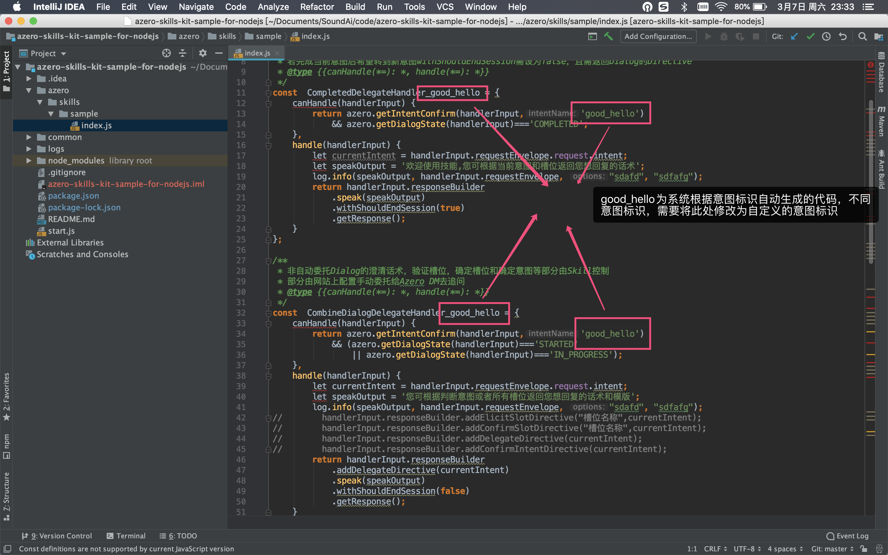
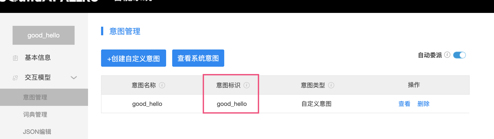
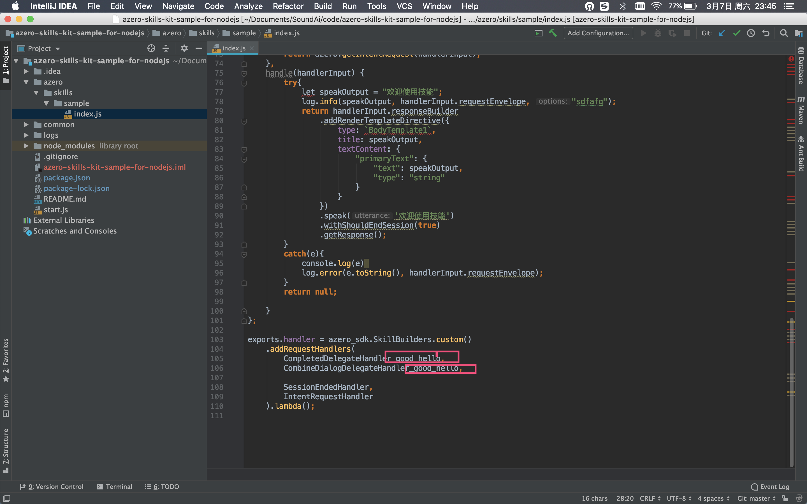
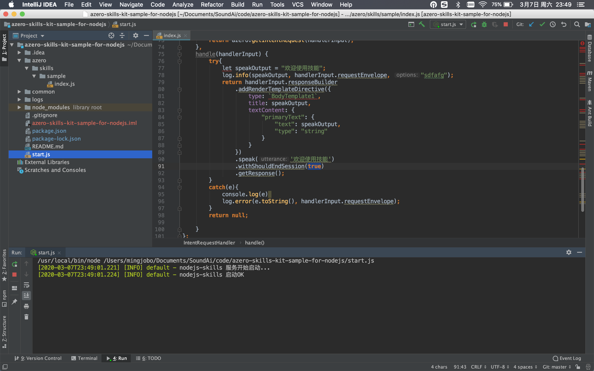
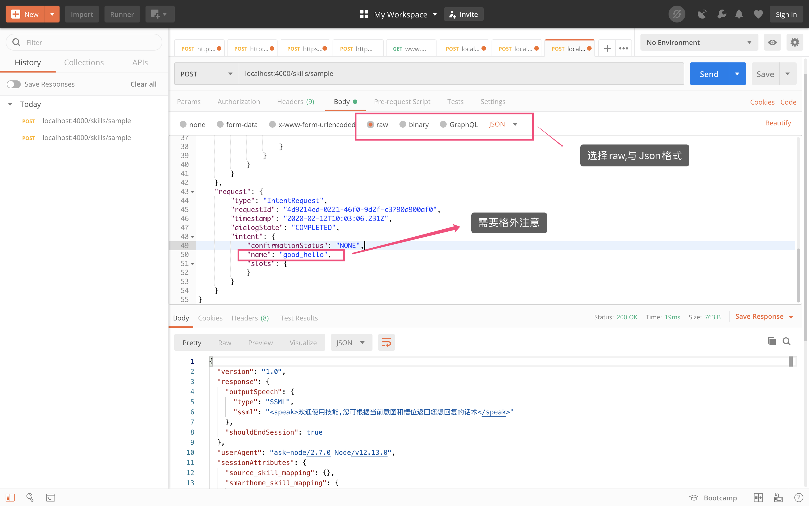

# AZERO Sample for nodejs

这是一个使用NodeJs帮助开发技能(Skill)的SDK。通过下载该Azero nodejs sample，以此为基础可以迅速的开发一个技能(Skill)。


## 前期准备

1.在建立工程前，请确保已创建技能意图。

查看自己是否已创建技能意图方法：

- 打开链接https://azero.soundai.com/ ，点击技能中心  ->  已创建技能
- 点击查看选项



- 点击意图管理，确认已经创建意图



如未创建技能意图，可阅读链接中技能接入介绍并创建技能意图：https://azero.soundai.com/docs/document

2.所需软件：

- IntelliJ IDEA    
- Nodejs    
- postman


## Sample相关介绍

### 相关组件介绍

#### azero-sdk-logger-*.tgz 日志组件

技能日志

使用方式：

```
const logger = require('azero-sdk-logger');
....
# 第二个参数必传
logger.debug("log message", handlerInput.requestEnvelope)
logger.info("log message", handlerInput.requestEnvelope)
logger.warn("log message", handlerInput.requestEnvelope)
logger.error("log message", handlerInput.requestEnvelope)
```

#### azero-sdk-util-*.tgz 自定义工具组件

支持以下功能：

Ip解析城市

使用方式：

```
const ipdb = require('ipip-ipdb')
...
var citys = new ipdb.City('ipipfree.ipdb')
var cityinfo = citys.findInfo("114.220.24.57", "CN")//114.220.24.57 需要技能开启获取IP服务才能获得
```
#### 数据持久化组件配置初始化

##### 主要配置：

#### start.js里面设置数据库环境变量

~~~~
//持久化配置
process.env.DBURL = 'mongodb://127.0.0.1:27017';
process.env.DATABASES = 'azero_skill';
~~~~

#### index.js文件里面初始化数据库

~~~~
//*引入BD持久化包
 const {MongoDbPersistenceAdapter, PartitionKeyGenerators} = require('azero-sdk-mongodb-persistence-adapter');
 //*初始化全局变量
 let persistenceAdapter;
 
 /**
  * 所有技能handler执行前执行的Interceptor
  * @type {{canHandle(*): *, handle(*): *}}
  */
 const RequestInterceptor = {
     process(handlerInput) {
         log.info('进入Interceptor处理方法中...',handlerInput.requestEnvelope);
         if (persistenceAdapter == undefined) {
             //初始化persistenceAdapter
             persistenceAdapter = new MongoDbPersistenceAdapter({
                 tableName: 'dbName', //要创建的表名
                 partitionKeyName: 'userId', //查询关键字 不写默认为id
                 attributesName: 'attributes', //查询对象，不写默认为attributes
                 partitionKeyGenerator: PartitionKeyGenerators.userId//partitionKeyName的值默认为userid
             });
         }
         log.info('Interceptor初始化完成...',handlerInput.requestEnvelope);
     }
 }
/**
 * 所有请求走之前都会执行addRequestInterceptors
 */
exports.handler = azero_sdk.SkillBuilders.custom()
    .addRequestInterceptors(RequestInterceptor)
    .lambda();
~~~~
#### azero-sdk-mongodb-persistence-adapter-*.tgz 属性数据持久化组件

#### 支持一下功能：

#### 属性数据存储

#### 属性数据查询

#### 属性数据删除

#### 具体实例参考index.js文件
~~~~
/**
 * 属性持久化组件
 * 必须初始化persistenceAdapter
 * 必须设置数据库url和数据库名(环境变量或者start.js里面设置)
 * 每个方法需async & await结合使用
 */
const persistenceAdapterResult = await persistenceAdapter.saveAttributes(handlerInput.requestEnvelope,handlerInput).then(msg=>{
    return msg;
});
log.info('属性持久化组件...保存数据方法返回值'+persistenceAdapterResult,handlerInput.requestEnvelope);
const persistenceAdapterResult1 =await persistenceAdapter.getAttributes(handlerInput.requestEnvelope).then(msg=>{
    return msg;
})
log.info('属性持久化组件...查询数据方法返回值'+persistenceAdapterResult1,handlerInput.requestEnvelope);
const persistenceAdapterResult2 =await persistenceAdapter.deleteAttributes(handlerInput.requestEnvelope).then(msg=>{
    return msg;
})
log.info('属性持久化组件...删除数据方法返回值'+persistenceAdapterResult2,handlerInput.requestEnvelope);
~~~~

### 重要文件介绍

#### start.js

为技能服务的启动文件，可以根据需求自行修改，具体代码如下:
~~~
const log4js = require('azero-sdk-logger');
const logger = log4js.getLogger('skills');
var app= require('express')();
// 引入json解析中间件
var bodyParser = require('body-parser');

//设置跨域访问
app.all('*', function(req, res, next) {
  res.header("Access-Control-Allow-Origin", "*");
  res.header("Access-Control-Allow-Headers", "X-Requested-With");
  res.header("Access-Control-Allow-Methods","PUT,POST,GET,DELETE,OPTIONS");
  res.header("X-Powered-By",' 3.2.1');
  res.header("Content-Type", "application/json;charset=utf-8");
  next();
});
//持久化配置
process.env.DBURL = 'mongodb://127.0.0.1:27017';
process.env.DATABASES = 'azero_skill';
//配置服务端口
var server = app.listen(4000, function () {
  var host = server.address().address;
  var port = server.address().port;
  logger.info('Example app listening at http://%s:%s', host, port);
  logger.info('nodejs-skills 启动OK');
});


var urlencodedParser = bodyParser.urlencoded({ extended: false });
app.use(urlencodedParser);
app.use(bodyParser.json());
app.post('/skills/:skillId', function (req, res) {//第二个参数是用一种解析方式解析
  res.writeHeader(200, {'Content-Type':'application/json;charset=UTF-8'});
  let skill = require('./azero/'+req.originalUrl+'/index');
  skill.handler(req.body, null, (error, result) => {
    if(error){
      res.writeHeader(500, {'Content-Type':'application/json;charset=UTF-8'});
      res.end( JSON.stringify(error.message, null, 2));
    }else{
      if(result!=undefined||result!=null){
        res.writeHeader(200, {'Content-Type':'application/json;charset=UTF-8'});
        res.end( JSON.stringify(result, null, 2));
      }else{
        res.writeHeader(500, {'Content-Type':'application/json;charset=UTF-8'});
        res.end( JSON.stringify(result, null, 2));
      }
    }
  });
});
~~~


#### index.js

index.js是技能的逻辑处理模块。技能中心的技能服务部署自动生成的代码，是Azero系统根据技能所配置的意图，自动生成的代码。代码内容可以复制到index.js中进行本地调试。以自定义意图good_hello为例，创建自定义意图之后，网页的服务部署中会生成相关代码，对应的代码在azero/skills/sample/index.js中。具体代码如下:

~~~
const azero = require('azero-sdk');
const azero_sdk = azero.sdk;
const log = require('azero-sdk-logger');
//*引入BD持久化包
const {MongoDbPersistenceAdapter, PartitionKeyGenerators} = require('azero-sdk-mongodb-persistence-adapter');
let persistenceAdapter;

/**
 * 所有技能handler执行前执行的Interceptor
 * @type {{canHandle(*): *, handle(*): *}}
 */
const RequestInterceptor = {
    process(handlerInput) {
        log.info('进入Interceptor处理方法中...',handlerInput.requestEnvelope);
        if (persistenceAdapter == undefined) {
            //初始化persistenceAdapter
            persistenceAdapter = new MongoDbPersistenceAdapter({
                tableName: 'dbName', //要创建的表名
                partitionKeyName: 'userId', //查询关键字 不写默认为id
                attributesName: 'attributes', //查询对象，不写默认为attributes
                partitionKeyGenerator: PartitionKeyGenerators.userId//partitionKeyName的值默认为userid
            });
        }
        log.info('Interceptor初始化完成...',handlerInput.requestEnvelope);
    }
}
/**
 Azero系统根据您自定义意图的意图标识以及您意图选用了禁用自动委派，自动生成此函数。
 若您的交互不涉及多轮对话(一问一答即完成对话)或对话交互业务复杂度可以完全委托给Azero系统根据前端意图配置中的澄清话术、意图确认等处理整个对话，建议您开启自动委派
 功能，忽略此函数。
 canhandle:判断传入此意图的请求是否要被此函数处理。默认判断规则为:请求中的意图标识与本意图标识匹配，且用户与技能对话交互还处于中间状态(DialogState为STARTED或IN_PROGRESS)。
 handle:当canhandle返回为true时,自动执行。由于意图禁用了自动委派，那么用户与技能对话交互过程，若有澄清话术，意图确认等需求，Azero会把此类请求传入此函数，您
 可以在此通过代码，手动对澄清话术，验证槽位，确定槽位和确定意图等业务做特殊处理。
 用户与技能对话交互过程(DialogState)，有三种状态:STARTED、IN_PROGRESS、COMPLETED。
 若完成当前意图后希望转到新意图withShouldEndSession需设为false，且需返回Dialog的Directive。
 */
const  CombineDialogDelegateHandler_test = {
    canHandle(handlerInput) {
        return azero.getIntentConfirm(handlerInput,'CombineDialogDelegate')
            && (azero.getDialogState(handlerInput)==='STARTED'
                || azero.getDialogState(handlerInput)==='IN_PROGRESS');
    },
    handle(handlerInput) {
        let currentIntent = handlerInput.requestEnvelope.request.intent;
        let speakOutput = '您可根据判断意图或者所有槽位返回您想回复的话术和模版';
//        handlerInput.responseBuilder.addElicitSlotDirective("槽位名称",currentIntent);
//        handlerInput.responseBuilder.addConfirmSlotDirective("槽位名称",currentIntent);
//        handlerInput.responseBuilder.addDelegateDirective(currentIntent);
//        handlerInput.responseBuilder.addConfirmIntentDirective(currentIntent);
        return handlerInput.responseBuilder
            .addDelegateDirective(currentIntent)
            .speak(speakOutput)
            .withShouldEndSession(false)
            .getResponse();
    }
};

/**
 Azero系统根据您自定义意图的意图标识自动生成此函数。
 canhandle:判断传入此意图的请求是否要被此函数处理。默认判断规则为：请求中的意图标识与本意图标识匹配，且用户与技能一次对话交互已经完成(即DialogState为COMPLETED)。
 handle:当canhandle返回为true时,自动执行。开发者需在handle内部编写此意图的业务逻辑代码。
 用户与技能对话交互过程(DialogState)，有三种状态:STARTED、IN_PROGRESS、COMPLETED。若意图不涉及多轮对话即可只关注COMPLETED状态。
 若完成当前意图后希望转到新意图withShouldEndSession需设为false，且需返回Dialog的Directive。
 */
const  CompletedDelegateHandler_test = {
    canHandle(handlerInput) {
        return azero.getIntentConfirm(handlerInput,'CombineDialogDelegate')
            && azero.getDialogState(handlerInput)==='COMPLETED';
    },
    handle(handlerInput) {
        let currentIntent = handlerInput.requestEnvelope.request.intent;
        let speakOutput = '欢迎使用技能,您可根据当前意图和槽位返回您想回复的话术';
        return handlerInput.responseBuilder
            .speak(speakOutput)
            .withShouldEndSession(true)
            .getResponse();
    }
};


/**
 * 用户取消和退出或者错误退出时的Handle
 * @type {{canHandle(*): *, handle(*): *}}
 */
const SessionEndedHandler={
    canHandle(handlerInput) {
        const request = handlerInput.requestEnvelope.request;
        return request.type === 'SessionEndedRequest';
    },
    handle(handlerInput) {
        return handlerInput.responseBuilder
            .withShouldEndSession(true)
            .getResponse();
    }
}

const IntentRequestHandler = {
    canHandle(handlerInput) {
        return azero.getIntentRequest(handlerInput);
    },
    async handle(handlerInput) {
        let speakOutput = "欢迎使用技能";
        //日志组件
        log.info('进入默认处理方法中...',handlerInput.requestEnvelope);
        /**
         * 属性持久化组件
         * 必须初始化persistenceAdapter
         * 必须设置数据库url和数据库名(环境变量或者start.js里面设置)
         * 每个方法需async & await结合使用
         */
        const persistenceAdapterResult = await persistenceAdapter.saveAttributes(handlerInput.requestEnvelope,handlerInput).then(msg=>{
            return msg;
        });
        log.info('属性持久化组件...保存数据方法返回值'+persistenceAdapterResult,handlerInput.requestEnvelope);
        const persistenceAdapterResult1 =await persistenceAdapter.getAttributes(handlerInput.requestEnvelope).then(msg=>{
            return msg;
        })
        log.info('属性持久化组件...查询数据方法返回值'+persistenceAdapterResult1,handlerInput.requestEnvelope);
        const persistenceAdapterResult2 =await persistenceAdapter.deleteAttributes(handlerInput.requestEnvelope).then(msg=>{
            return msg;
        })
        log.info('属性持久化组件...删除数据方法返回值'+persistenceAdapterResult2,handlerInput.requestEnvelope);

        const template = azero.getDefaultTemplateData({
            token:'token',
            backgroundImage:{
                sources:[
                    {url:"http://ssds.background_image_sources.com"}
                ]
            },
            title:{
                mainTitle:'主标题',
                subTitle:'副标题'
            },
            textField:'文本内容',
            extContent:{
                data: '自定义数据',
                type:'领域',
                TTSText:'tts文本内容',
                ASRText:'ASR结果'
            }
        })
        return handlerInput.responseBuilder
            .addRenderTemplateDirective(template)
            .speak(speakOutput)
            .withShouldEndSession(true)
            .getResponse();
    }
};
/**
 * 所有请求走之前都会执行addRequestInterceptors
 *所有意图函数都需要添加到addRequestHandler中。保证Azero系统能正常将用户的意图请求传入
 *对应的意图函数进行处理。服务部署一般会自动生成添加代码。
 */
exports.handler = azero_sdk.SkillBuilders.custom()
    .addRequestInterceptors(RequestInterceptor)
    .addRequestHandlers(
        CompletedDelegateHandler_test,
        CombineDialogDelegateHandler_test,

        SessionEndedHandler,
        IntentRequestHandler
    ).lambda();

~~~

- IntentRequestHandler是公共意图的处理函数，若意图request没有匹配到对应的意图Handler则执行该函数逻辑。
- CompletedDelegateHandler(若配置了自定义意图，假设意图标识为good_hello，该函数将会变成CompletedDelegateHandler_good_hello)应用于自动委托Dialog场景，澄清话术，验证槽位，确定槽位和确定意图等逻辑都委托Azero系统处理，Azero系统处理完后，会将最终的意图请求参数(槽位信息、位置信息、设备信息、用户信息等)交由该函数处理。所有的逻辑处理函数的返回结果可以是json Object 也可以是Promise包裹的json Object。示例中的处理逻辑比较简单，只做演示使用，用户可以根据自己的需求进行逻辑的扩展以及模块的封装。 若完成当前意图后希望转到新意图，需设置withShouldEndSession为false，且需返回Dialog的Directive。
- CombineDialogDelegateHandler_good_hello(若配置了自定义意图，假设意图标识为good_hello，该函数将会变成CombineDialogDelegateHandler_good_hello)是应用于非自动委托Dialog的场景，需在其中进行，澄清话术，验证槽位，确定槽位和确定意图等逻辑设计，部分也可由网站上配置手动委托给Azero 系统去追问。

- SessionEndedRequestHandler是在会话结束之后执行该处理函数
- ErrorHandler是在调用技能处理逻辑报错时会执行该处理函数
- SampleRequestInterceptor是request的拦截器处理函数
- SampleResponseInterceptor是response的拦截器处理函数


## 搭建本地开发环境

#### 1.安装依赖

- 在项目根目录下的npm文件夹中，安装所有安装包(在npm目录下执行npm install xxx.tgz)，例如（windows 环境）:

```
cd npm
npm  install azero-sdk-2.9.0.tgz
npm  install azero-sdk-logger-2.8.1.tgz
npm  install azero-sdk-util-2.1.1.tgz
npm  install azero-sdk-mongodb-persistence-adapter-2.8.1.tgz
cd ..
node start.js
```

- 安装其他相关依赖包，项目根目录执行“npm install”命令来完成相关依赖安装

#### 2.导入工程

运行IntelliJ IDEA，点击Import Project,选择下载好的azero_sample_for_nodejs.一直下一步。最终导入成功的状态如下:



#### 3.选择编译配置



点击add configuration - > 左上角加号 - > 选择Node.js

若找不到Node.js,表示IDE未安装Node.js的插件。

mac中，安装方式如下:Preferences -> Plugins -> 搜索nodejs进行安装，如下图：



window:file -> setting -> Plugins -> Browse repositiories，搜索nodejs，点击安装。

#### 4.修改index.js



具体可以去网站相关技能下的意图管理中获取:



此处也需要修改为相关意图标识的后缀：



经过上面的修改，则将本地开发环境配置成网页服务部署的开发环境一样的状态。

#### 5.运行start.js

选择start.js,右键然后选择run start.js,将服务运行起来，服务启动成功状态如下:



#### 6.使用Postman进行模拟测试

打开Postman，选择post方式，输入测试地址: http://localhost:4000/skills/sample

选择body，点击raw，选择格式为Json。输入如下Json:

~~~
{
	"version": "1.0",
	"session": {
		"new": true,
		"sessionId": "token.domain-api.session.5e43cd5a2e266d0006dbdf1b",
		"application": {
			"applicationId": "5e3be9a6ac159c0008311354"
		},
		"user": {
			"userId": "anonymous_d4730993d7314c60b65d4811706aebc9"
		},
		"attributes": {
			"source_skill_mapping": {
				
			},
			"smarthome_skill_mapping": {
				"5e0f243c4faed10007b7d466": "jiojo"
			},
			"ip": "172.20.3.48"
		}
	},
	"context": {
		"System": {
			"application": {
				"applicationId": "5e3be9a6ac159c0008311354"
			},
			"user": {
				"userId": "anonymous_d4730993d7314c60b65d4811706aebc9"
			},
			"device": {
				"deviceId": "9e5538d03226ec895e2292612b079b92",
				"supportedInterfaces": {
					"AudioPlayer": {
						
					},
					"Display": {
						
					}
				}
			}
		}
	},
	"request": {
		"type": "IntentRequest",
		"requestId": "4d9214ed-0221-46f0-9d2f-c3790d900af0",
		"timestamp": "2020-02-12T10:03:06.231Z",
		"dialogState": "COMPLETED",
		"intent": {
            "confirmationStatus": "NONE",
            "name": "CombineDialogDelegate",
            "slots": {
            }
        }
	}
}
~~~

或者curl的方式：
~~~
curl --location --request POST 'http://localhost:4000/skills/sample' \
--header 'Content-Type: application/json' \
--data-raw '{
	"version": "1.0",
	"session": {
		"new": true,
		"sessionId": "token.domain-api.session.5e43cd5a2e266d0006dbdf1b",
		"application": {
			"applicationId": "5e3be9a6ac159c0008311354"
		},
		"user": {
			"userId": "anonymous_d4730993d7314c60b65d4811706aebc9"
		},
		"attributes": {
			"source_skill_mapping": {},
			"smarthome_skill_mapping": {
				"5e0f243c4faed10007b7d466": "jiojo"
			},
			"ip": "172.20.3.48"
		}
	},
	"context": {
		"System": {
			"application": {
				"applicationId": "5e3be9a6ac159c0008311354"
			},
			"user": {
				"userId": "anonymous_d4730993d7314c60b65d4811706aebc9"
			},
			"device": {
				"deviceId": "9e5538d03226ec895e2292612b079b92",
				"supportedInterfaces": {
					"AudioPlayer": {},
					"Display": {}
				}
			}
		}
	},
	"request": {
		"type": "IntentRequest",
		"requestId": "4d9214ed-0221-46f0-9d2f-c3790d900af0",
		"timestamp": "2020-02-12T10:03:06.231Z",
		"dialogState": "COMPLETED",
		"intent": {
			"confirmationStatus": "NONE",
			"name": "CombineDialogDelegate",
			"slots": {}
		}
	}
}'
~~~

**注意：此json中，截图画框处，需要根据自定义意图标识做相关修改**



如果返回格式如上图，则表示本地调试环境成功跑通。

**重点:将本地调试成功的index.js中的各个模块的业务逻辑代码复制到AZERO平台的服务部署代码编辑中，进行服务部署，后续可以使用模拟测试功能进行线上调试（注意：因线上环境azero-sdk进行了封装，需将本地调试的index.js中的const azero = require('./azero-sdk')上线时需要改为const azero = require('azero-sdk')），不然网页模拟测试将会报技能服务异常**。


## 方法介绍

#### Demo中azero_sdk提供两种方式创建Handler

```
const customSkillBuilder = azero_sdk.SkillBuilders.custom();
const standardSkillBuilder = azero_sdk.SkillBuilders.standard();
```

#### 创建的Handler可以支持以下函数：

```
addRequestHandler(matcher : ((handlerInput : HandlerInput) => Promise<boolean> | boolean) |    														 string, executor : (handlerInput : HandlerInput) => Promise<Response> | Response) : this;
addRequestHandlers(...requestHandlers : RequestHandler[]) : this;
addRequestInterceptors(...executors : Array<RequestInterceptor | ((handlerInput : HandlerInput)             					            			 => Promise<void> | void)>) : this;
addResponseInterceptors(...executors : Array<ResponseInterceptor | ((handlerInput :     			      														HandlerInput, response? : Response) => Promise<void> | void)>) : 															this;
addErrorHandler(matcher : (handlerInput : HandlerInput, error : Error) => Promise<boolean> | 															boolean, executor : (handlerInput : HandlerInput, error : Error) => 														Promise<Response> | Response) : this;
addErrorHandlers(...errorHandlers : ErrorHandler[]) : this;
withCustomUserAgent(customUserAgent : string) : this;
withSkillId(skillId : string) : this;
getSkillConfiguration() : SkillConfiguration;
create() : Skill;
lambda() : LambdaHandler;
```

#### Demo中azero支持以下方法：

```
getLocale(handlerInput): string;
getRequestType(handlerInput): string;
getIntentName(handlerInput): string;
getAccountLinkingAccessToken(handlerInput): string;
getApiAccessToken(handlerInput): string;
getDeviceId(handlerInput): string;
getUserId(handlerInput): string;
getDialogState(handlerInput): string;
getSlot(handlerInput): Slot;
getSlotValue(handlerInput): string;
getSupportedInterfaces(handlerInput): SupportedInterfaces;
isNewSession(handlerInput): boolean;
getIntentRequest(handlerInput):boolean;
getIntentConfirm(handlerInput,intentName):boolean;
```

### Template展现模版

- 为了更好的在有屏设备端上展现技能，AZERO提供了多种展现模板供开发者使用。展现模板分body template、list template、default template data三种类型。其中body template由图片和文字组成，list template由一系列list item组成，每个list item由图片和文字组成。default template date适用于需要携带额外信息给设备端。不同的展现模板适合不同的场景，开发者可以根据技能展现的需求选择合适的模板
- 添加返回端上的模版方法使用到addRenderTemplateDirective方法，示例代码如下:
~~~~
//以模板DefaultTemplateData为例
const IntentRequestHandler = {
    canHandle(handlerInput) {
        return azero.getIntentRequest(handlerInput);
    },
    async handle(handlerInput) {
        let speakOutput = "欢迎使用技能";
        //日志组件
        log.info('进入默认处理方法中...',handlerInput.requestEnvelope);
        //编辑DefaultTemplateData模板开始处
        const template = azero.getDefaultTemplateData({
            token:'token',
            backgroundImage:{
                sources:[
                    {url:"http://ssds.background_image_sources.com"}
                ]
            },
            title:{
                mainTitle:'主标题',
                subTitle:'副标题'
            },
            textField:'文本内容',
            extContent:{
                data: '自定义数据',
                type:'领域',
                TTSText:'tts文本内容',
                ASRText:'ASR结果'
            }
        })
        //编辑DefaultTemplateData模板结束处
        return handlerInput.responseBuilder
            .addRenderTemplateDirective(template)
            .speak('欢迎使用技能')
            .withShouldEndSession(true)
            .getResponse();
    }
};

~~~~
#### BodyTemplate 共有5种类型模板可供选择

#### 文本展现模板 BodyTemplate1

- 此模板适用于展示纯文本信息场景，包含以下内容：
  - title:技能名称或者技能当前页面主题
  - token:模板的唯一标识
  - backButton:开发者在技能发布时需进行上传(可选)，返回按钮(展示/隐藏)
  - backgroundImage:技能交互时作为背景展示的图片（可选）
  - textContent:技能交互时界面展示的文本信息
    - 一级文本:primaryText
    - 二级文本:secondaryText(可选)
    - 三级文本:tertiaryText(可选)

```
{
  "type":"BodyTemplate1",
  "token": "string",
  "backButton": "VISIBLE"(default) | "HIDDEN",
  "backgroundImage": Image,
  "title": "string",
  "textContent": TextContent
}
```

#### 图片和文本展现模板 BodyTemplate2

- 此模板适用于同时展示图片和文字的使用场景，其中图片展现在屏幕右侧，文字展现在屏幕左侧。包含以下内容：
  - title:技能名称或者技能当前页面主题
  - token:模板的唯一标识
  - backButton:开发者在技能发布时需进行上传(可选)，返回按钮(展示/隐藏)
  - image:展示的图片
  - backgroundImage:技能交互时作为背景展示的图片（可选）
  - textContent:技能交互时界面展示的文本信息
    - 一级文本:primaryText
    - 二级文本:secondaryText(可选)
    - 三级文本:tertiaryText(可选)

```
{
  "type":"BodyTemplate2",
  "token": "string",
  "backButton": "VISIBLE"(default) | "HIDDEN",
  "backgroundImage": Image,
  "title": "string",
  "image": Image,
  "textContent": TextContent
}
```

#### 图片和文本展现模板 BodyTemplate3

- 此模板适用于同时展示图片和文字的使用场景，其中图片展现在屏幕左侧，文字展现在屏幕右侧。包含以下内容：
  - title:技能名称或者技能当前页面主题
  - token:模板的唯一标识
  - backButton:开发者在技能发布时需进行上传(可选)，返回按钮(展示/隐藏)
  - image:展示的图片
  - backgroundImage:技能交互时作为背景展示的图片（可选）
  - textContent:技能交互时界面展示的文本信息
    - 一级文本:primaryText
    - 二级文本:secondaryText(可选)
    - 三级文本:tertiaryText(可选)

```
{
  "type":"BodyTemplate3",
  "token": "string",
  "backButton": "VISIBLE"(default) | "HIDDEN",
  "backgroundImage": Image,
  "title": "string",
  "image": Image,
  "textContent": TextContent
}
```

#### 图片和文本展现模板 BodyTemplate4

- 此模板适用于展示文字和背景图片使用场景，其中背景图片可在屏幕区域内进行自适应展示。包含以下内容：
  - title:技能名称或者技能当前页面主题
  - token:模板的唯一标识
  - backButton:开发者在技能发布时需进行上传(可选)，返回按钮(展示/隐藏)
  - image:展示的图片
  - backgroundImage:技能交互时作为背景展示的图片（可选）
  - textContent:技能交互时界面展示的文本信息
    - 一级文本:primaryText
    - 二级文本:secondaryText(可选)
    - 三级文本:tertiaryText(可选)

```
{
  "type":"BodyTemplate4",
  "token": "string",
  "backButton": "VISIBLE"(default) | "HIDDEN",
  "backgroundImage": Image,
  "title": "string",
  "image": Image,
  "textContent": TextContent
}
```

#### 图片展现模板 BodyTemplate5

- 此模板适用于展示可缩放的前景图片以及带有背景图片的使用场景。包含以下内容：
  - title:技能名称或者技能当前页面主题
  - token:模板的唯一标识
  - backButton:开发者在技能发布时需进行上传(可选)，返回按钮(展示/隐藏)
  - image:展示的图片
  - backgroundImage:技能交互时作为背景展示的图片（可选）

```
{
  "type":"BodyTemplate5",
  "token": "string",
  "backButton": "VISIBLE"(default) | "HIDDEN",
  "backgroundImage": Image,
  "title": "string",
  "image": Image
}
```

### ListTemplate 共有2种类型模板可供选择

#### ListTemplate1

- 此模板是纵向列表模板，适用于展现纵向的文本和图片场景。包含以下内容：
  - title:技能名称或者技能当前页面主题
  - token:模板的唯一标识
  - backButton:开发者在技能发布时需进行上传(可选)，返回按钮(展示/隐藏)
  - backgroundImage:技能交互时作为背景展示的图片（可选）
  - listItems:列表项，包含文本和图片信息
    - token:图片的序号
    - image:背景图片
    - textContent:
      - 一级文本:primaryText
      - 二级文本:secondaryText(可选)
      - 三级文本:tertiaryText(可选)

```
{
  "type": "ListTemplate1",
  "token": "string",
  "backButton": "VISIBLE"(default) | "HIDDEN",
  "backgroundImage": "Image",
  "title": "string",
  "listItems": [
    {
      "token": "string",
      "image": Image,
      "textContent": TextContent
    },
    ...
    ...
    {
      "token": "string",
      "image": Image,
      "textContent": TextContent
    }
  ]
}
```

#### ListTemplate2

- 此模板是横向列表模板，适用于展现横向的文本和图片场景。包含以下内容：
  - title:技能名称或者技能当前页面主题
  - token:模板的唯一标识
  - backButton:开发者在技能发布时需进行上传(可选)，返回按钮(展示/隐藏)
  - backgroundImage:技能交互时作为背景展示的图片（可选）
  - listItems:列表项，包含文本和图片信息
    - token:图片的序号
    - image:背景图片
    - textContent:
      - 一级文本:primaryText
      - 二级文本:secondaryText(可选)

```
{
  "type": "ListTemplate2",
  "token": "string",
  "backButton": "VISIBLE"(default) | "HIDDEN",
  "backgroundImage": "Image",
  "title": "string",
  "listItems": [
    {
      "token": "string",
      "image": Image,
      "textContent": TextContent
    },
    ...
    ...
    {
      "token": "string",
      "image": Image,
      "textContent": TextContent
    }
  ]
}
```

#### DefaultTemplateData

此模板用于需要带更多自定义数据到设备端的场景，包含以下内容：

- title:技能名称或者技能当前页面主题
- data:自定义数据，可以是一段json转为String，然后端上重新解析为Json，自定义操作内容
- TTSText:语音播报的文本内容
- ASRText:语音识别后的文本内容
- textField:技能当前页面的展示文本的具体内容

~~~
"payload": {
      "backgroundImage":{
        "sources":[
            {
                "url":"{{STRING}}"
            }
        ]
      },
      "type": "DefaultTemplateData",
      "title": {
        "mainTitle": "{{STRING}}",
        "subTitle": "{{STRING}}"
      },
      "extContent": {
        "data":"{{STRING}}",//自定义数据，可以是一段json转为String，然后端上重新解析为Json，自定义操作内容。
        "type": "{{STRING}}",//领域
        "TTSText": "{{STRING}}",//tts文本内容
        "ASRText": "{{STRING}}" //ASR结果
      },
      "textField": "{{STRING}}"     
    }
  }
~~~

